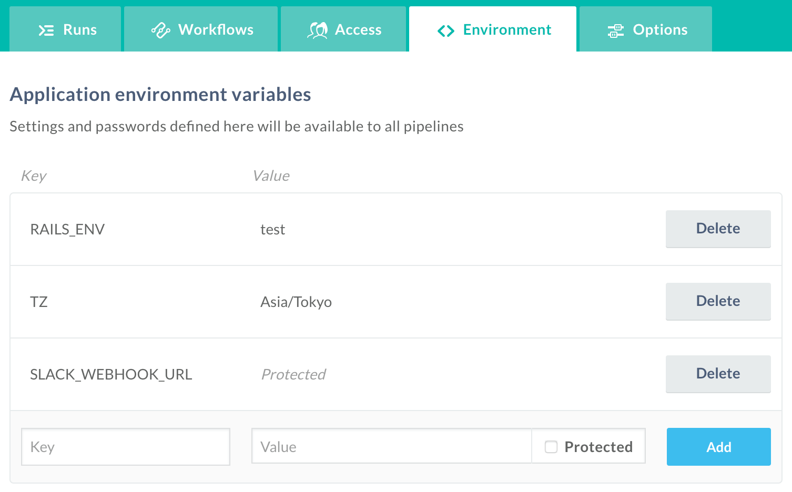

[オラクルに買収](https://jp.techcrunch.com/2017/04/18/20170417developer-tools-startup-wrecker-has-been-acquired-by-oracle/)されてから存在感が薄くなった(?)ような気がする[Wercker](http://www.wercker.com/)ですが、使う機会があったのでRailsでの設定をメモしておきます。

```yaml
# wercker.yml
box:
  id: ruby:2.5.1

services:
  - id: mysql:5.7
    env:
      # rails-database-yml stepはrootユーザーを使わないのでランダムパスワードにしておく
      MYSQL_RANDOM_ROOT_PASSWORD: 'yes'
      # 以下の3つを設定する必要がある
      MYSQL_DATABASE: rails_test
      MYSQL_USER: rails
      MYSQL_PASSWORD: password

  - id: redis:4

build:
  steps:
    # Node.jsは入っていないのでインストールする
    - script:
        name: install node.js
        code: curl -fsSL https://deb.nodesource.com/setup_8.x | bash - && apt-get install -qq nodejs
    # bundleのキャッシュもしてくれる
    # https://github.com/wercker/step-bundle-install
    - bundle-install
    # 自動的にdatabase.ymlの設定をしてくれる
    # https://github.com/wercker/step-rails-database-yml
    - rails-database-yml
    - script:
        name: copy .env
        code: cp .env.sample .env
    # Redisの接続先この方法でしか取れなかったけどもっといい方法ありそう
    - script:
        name: redis config
        code: echo REDIS_URL=redis://$REDIS_PORT_6379_TCP_ADDR:$REDIS_PORT_6379_TCP_PORT >> .env
    - script:
        name: db setup
        code: bundle exec rails db:schema:load db:seed_fu
    - script:
      name: rspec
      code: bundle exec rspec

  after-steps:
    # Slack通知
    # https://github.com/wercker/step-slack
    - slack-notifier:
      # 環境変数で設定
      url: $SLACK_WEBHOOK_URL
      channel: channel_name
      username: wercker
```

環境変数はWeb画面上で設定し、`wercker.yml`内では`$変数名`で参照します。「Protected」にすると設定値が見えなくなるので、秘匿情報を設定するときに便利です。


