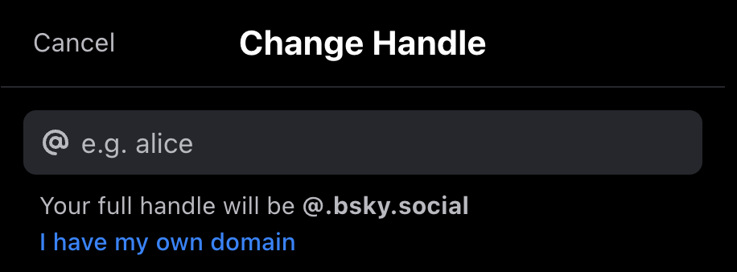
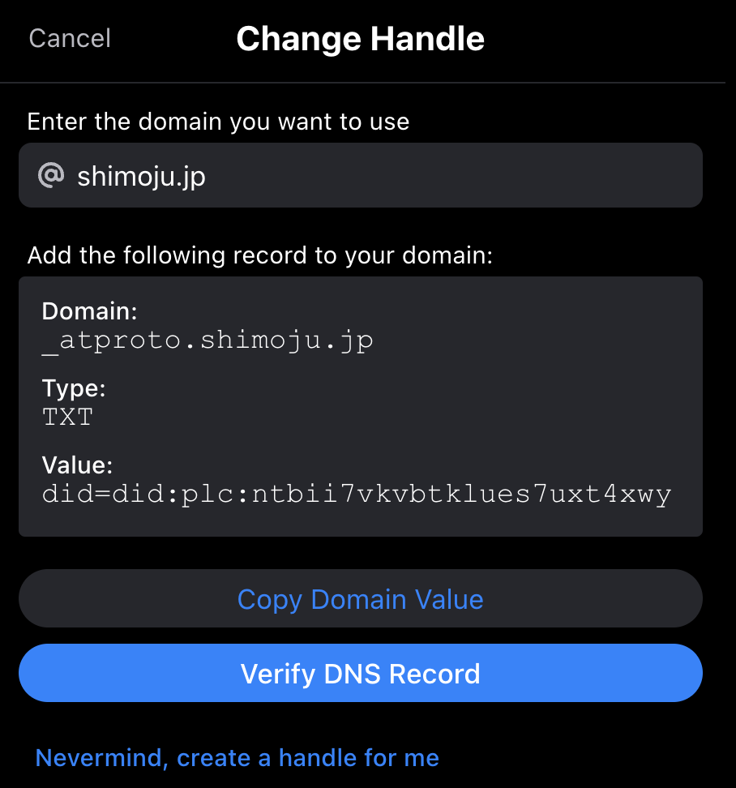
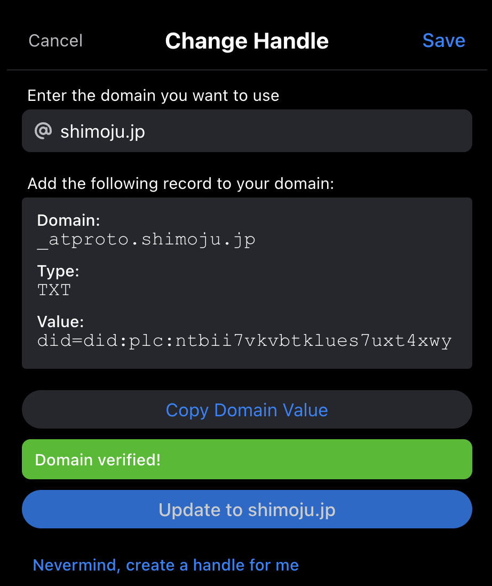

同僚から[Bluesky](https://bsky.app/)の招待コードをもらったので登録してみた。

- https://bsky.app/profile/shimoju.jp

どうやら現状はログインしていないとプロフィールすら閲覧できないっぽい。招待コードは2つ余っているのでTwitterなどで声をかけていただければ。

いまのところ見た目はまんまTwitterという感じで、非中央集権型SNSを実現するプロトコルとしても[ActivityPub](https://www.w3.org/TR/activitypub/)という先例があるので、[AT Protocol](https://atproto.com/)がどのように差別化を図っていくのか気になる。

Twitterの雲行きが怪しい昨今、Mastodonなど含め色々試しつつ、複数の発信手段を確保しておきたい気持ち。このブログを整備し直したのもその一環だし。

## ハンドルネームにカスタムドメインを設定する

[Blueskyはハンドルとして任意のドメインを設定できる](https://gigazine.net/news/20230421-bluesky-handle-domain-name/)ようになっており、DNSレコードを用いて本人認証を実現できる。
これはユニークな機能で他のSNSにもほしいと思った。

Settings→Change handleからハンドル設定画面を開き、「I have my own domain」をクリック。

設定したいハンドル（ドメイン名）を入力した上で、そのドメインの`_atproto`サブドメインに対してTXTレコードを設定する。

「Verify DNS Record」をクリックしてDNSレコードを検証する。成功したら「Domain verified!」のメッセージが出るのでSaveすれば変更完了。

なお、ハンドルを変更した時点で、元の`*.bsky.social`のハンドルは即座に取得可能になる。そのため元のハンドルも取られたくない場合は別のアカウントを用意しておく必要がある。

`*.bsky.social`なハンドルは残したまま、カスタムドメインのハンドルはエイリアスのように機能してくれると助かる気がした。
とくにDNSレコードを消したりドメインが失効するなどしたとき困るだろうし…（この設定後にドメイン検証に失敗するとどうなるんだろうか、よくわかっていない）
