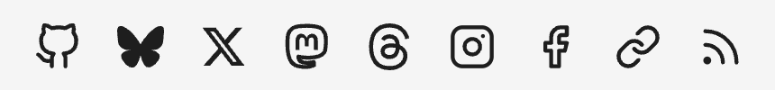

あけましておめでとうございます。
最近は[Bluesky](https://bsky.app/profile/shimoju.jp)でひたすらゲームの話をしています。

ということで今年の書き初め、もとい新年初Pull RequestはBlueskyにかかわるもの。
このブログで利用している[Hugo PaperMod](https://github.com/adityatelange/hugo-PaperMod)テーマに[Blueskyのアイコンを追加しました](https://github.com/adityatelange/hugo-PaperMod/pull/1383)。

実際に設置すると[こんな感じ](/)。めっちゃええやん。

上のように、Hugo PaperModには[トップページに簡単なプロフィールを掲載できる機能](https://github.com/adityatelange/hugo-PaperMod/wiki/Features#home-info-mode)があり、そこに[各種SNSへのアイコン付きリンク](https://github.com/adityatelange/hugo-PaperMod/wiki/Icons)を設置できます。
各サービスのアイコンはライトモード・ダークモード両対応のため、色の指定に[currentcolorキーワード](https://developer.mozilla.org/ja/docs/Web/CSS/color_value#currentcolor_%E3%82%AD%E3%83%BC%E3%83%AF%E3%83%BC%E3%83%89)を用いた[SVGとしてリポジトリに格納](https://github.com/adityatelange/hugo-PaperMod/blob/master/layouts/partials/svg.html)されており、現在のcolorプロパティの値に応じて色を切り替えられるようになっています。
したがってすべてのアイコンは単色で表現されます。

以前からBlueskyのアイコンを追加したかったのですが、これまではロゴとして特徴のないただの青空だったため、単色のSVGで表現するのが困難でした。
[12月21日に蝶をモチーフにしたロゴに変更された](https://www.itmedia.co.jp/news/articles/2312/25/news082.html)ことでSVGにしやすくなり、これはチャンスとPRを送ったところ無事マージされました🎉

サービスの象徴となるアイコンが作られたことでこういったプロフィールにも掲載しやすくなったし、Bluesky自体にも愛着が湧いてくる良いロゴになったと思います。
Hugo PaperModを使っているBlueskyユーザーがいればぜひ。
