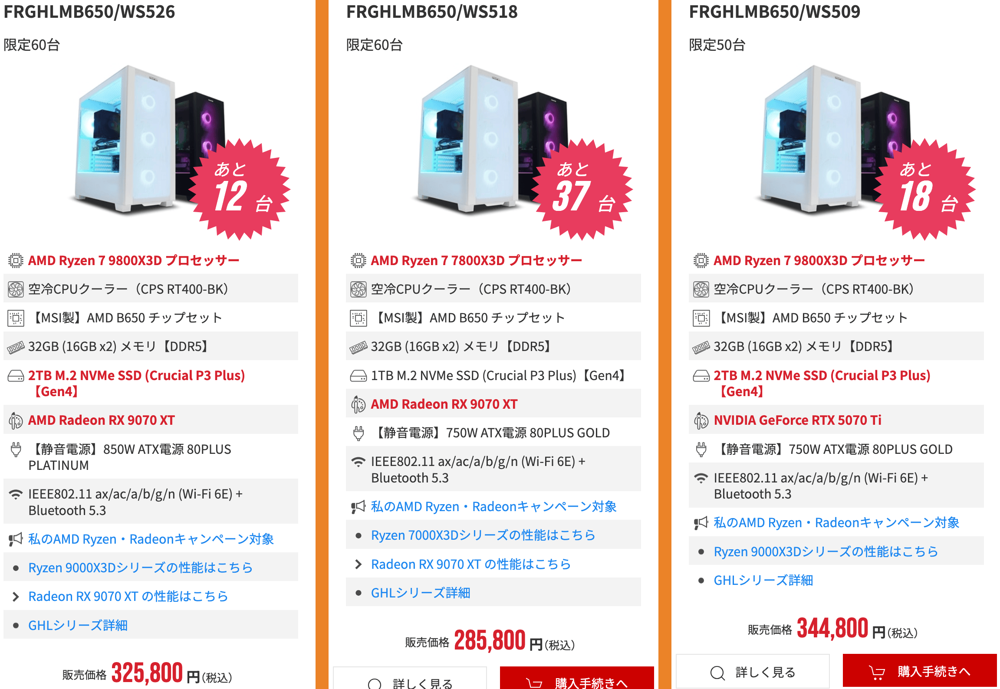

2021年に[マウスコンピューターのゲーミングPC](https://scrapbox.io/shimoju/%E3%83%9E%E3%82%A6%E3%82%B9%E3%82%B3%E3%83%B3%E3%83%94%E3%83%A5%E3%83%BC%E3%82%BF%E3%83%BC_%E3%82%B2%E3%83%BC%E3%83%9F%E3%83%B3%E3%82%B0PC_G-Tune_TD-P)を購入し、4年以上使ってきました。
RTX 3080ということもあり普通にゲームをプレイするだけなら不満はなく、もう1、2年は問題なく使えそうではあります。

しかし[モンスターハンターワイルズ](https://www.monsterhunter.com/wilds/ja-jp/)がフレーム生成を前提にしていて、DLSSによるフレーム生成に未対応のRTX 3000シリーズではFSR 3を使わざるを得ず、性能を有効活用できていない感じがしたこと。
また、現在プレイ中の[鳴潮](https://wutheringwaves.kurogames.com/jp/main)がレイトレーシングに対応したものの、RTX 3080ではレイトレーシングと120fpsの両立が難しいことから買い替えの機運が高まってきました。

今回はPCケースにこだわりたかったのと、当時よりパーツの知識も増えたし、いい機会なので自作に挑戦してみました。
予算は30±2万円。円安に加えてグラフィックボードも高騰する今、果たしていけるのか？

## 構成

| | パーツ | 購入金額 | 販売店 |
| - | - | - | - |
| CPU | [Ryzen 7 9700X](https://www.amd.com/ja/products/processors/desktops/ryzen/9000-series/amd-ryzen-7-9700x.html) | 50,792円 | [Amazon](https://www.amazon.co.jp/dp/B0D6NMDNNX) |
| グラフィックボード | [Palit GeForce RTX 5070 Ti GamingPro V1](https://www.palit.com/palit/vgapro.php?id=5535&lang=jp) | 147,800円 | [ドスパラ](https://www.dospara.co.jp/SBR1892/IC524089.html) |
| マザーボード | [GIGABYTE B850 AORUS ELITE WIFI7 ICE](https://www.gigabyte.com/jp/Motherboard/B850-AORUS-ELITE-WIFI7-ICE-rev-1x) | 32,222円 | [Amazon](https://www.amazon.co.jp/dp/B0DQLKRXKW) |
| メモリ | [Crucial Pro DDR5-6400 32GB Kit White](https://www.crucial.jp/memory/ddr5/cp2k16g64c38u5w) | 13,880円 | [ドスパラ](https://www.dospara.co.jp/SBR1534/IC515389.html) |
| SSD | [Western Digital WD_BLACK SN7100 2TB](https://shop.sandisk.com/ja-jp/products/ssd/internal-ssd/wd-black-sn7100-nvme-internal-ssd?sku=WDS200T4X0E-00CJA0) | 20,780円 | [ドスパラ](https://www.dospara.co.jp/SBR1144/IC520428.html) |
| SSD | [KIOXIA EXCERIA PLUS G4 2TB](https://www.kioxia.com/ja-jp/personal/ssd/exceria-plus-g4-nvme-ssd.html) | 26,470円 | [ドスパラ](https://www.dospara.co.jp/SBR1144/IC520064.html) |
| 電源ユニット | [ドスパラセレクト 850W-GOLD-ATX31-WH](https://www.dospara.co.jp/SBR83/IC505486.html) | 16,980円 | [ドスパラ](https://www.dospara.co.jp/SBR83/IC505486.html) |
| PCケース | [MONTECH XR ホワイト ドスパラ限定モデル](https://www.dospara.co.jp/SBR79/IC514294.html) | 7,980円 | [ドスパラ](https://www.dospara.co.jp/SBR79/IC514294.html) |
| CPUクーラー | [MONTECH HyperFlow Silent 360 White](https://www.montechpc.com/hyperflow-silent-360) | 12,800円 | [ドスパラ](https://www.dospara.co.jp/SBR321/IC518029.html) |
| サポートステイ | [長尾製作所 VGAサポートステイS マグネット式 ホワイト](http://www.nagao-ss.co.jp/n-vgastay-s-wh.html) | 1,800円 | [ヨドバシ](https://www.yodobashi.com/product-detail/100000001007109947/) |
| OS | Windows 11 Home | 16,480円 | [ドスパラ](https://www.dospara.co.jp/SBR170/IC479480.html) |
| ポイント利用 | | -1,873円 | |
| 合計金額 | | 346,111円 | |

初心者でAliExpressはチャレンジングすぎると思いすべて国内で購入しました。
いくつかのパーツを調べたところドスパラにいい物が揃っており、結果的にCPU・マザーボード・サポートステイ以外はドスパラになりました。

値段だけ見ると完全に予算を超過してるじゃん！ってなるけど、これは旧PCからストレージだけ移設する予定だったのが、代わりに旧PCをまるごと買取に出し、そのお金でSSDを買い足すことにしたため。
SSDひとつだけで考えると346,111 - 26,470 = 319,641円となり、ギリ32万円に収まりました🎉

### コンセプト

旧PCはサイドパネルだけガラスの黒いプラスチックケースで、重苦しい雰囲気なので次はホワイト、さらに[ピラーレス](https://www.sofmap.com/contents/?id=nw_ps_select&sid=pillarless)にしたいと考えていました。
PCはデスクの上に置いているため小さいに越したことはないのですが、拡張性や初自作であることを考慮するとATXサイズ（ミドルタワー）が無難だろうと判断。

そこで白いピラーレスケースのうち幅が狭いものを探したところ、[MONTECH XR](https://www.dospara.co.jp/SBR79/IC514294.html)が価格面でも機能面でもベストだったので、これにあうようにパーツを選定しました。

モニターは以前購入した4K/144Hzの[GIGABYTE M28U](https://scrapbox.io/shimoju/GIGABYTE_M28U)を引き続き利用する想定。
フレームレートを求められる競技ゲームはほとんどやらず、4Kモニターを活かしたグラフィック重視のゲームプレイがメインです。
そのためCPUの予算を抑えてグラフィックボードを優先しました。

### CPU

- [Ryzen 7 9700X](https://www.amd.com/ja/products/processors/desktops/ryzen/9000-series/amd-ryzen-7-9700x.html)（50,792円）

ゲーム用途ではRyzen X3Dシリーズが第一候補になりますが、競技ゲームはプレイしないし、4Kゲーミングでは大きな差が出ないことからRyzen 7 9700Xを選択。

9800X3Dは8〜9万円とさすがに高いので見送ったけど、7800X3Dは記事執筆時点で[61,000円台まで値下がり](https://kakaku.com/item/K0001507444/)しており、この価格差なら7800X3Dがよかったかもしれない……。

### グラフィックボード

- [Palit GeForce RTX 5070 Ti GamingPro V1](https://www.palit.com/palit/vgapro.php?id=5535&lang=jp)（147,800円）

数か月前から自作PCを検討していて、[Radeon RX 9070 XT](https://www.amd.com/ja/products/graphics/desktops/radeon/9000-series/amd-radeon-rx-9070xt.html)がコスパが高く本命だったものの、人気が集中して値段が下がらない状況でした。
そうこうしているうちにRTX 5070 Tiが定価まで値下がりして147,800円になり、対して9070 XTは133,800円。
「1万円の差しかないなら5070 Tiでよくない？」となって購入を決めました。
残念ながらホワイトモデルがないのでグラフィックボードだけ黒くなってしまいました。次回はオールホワイトを実現したい。

こちらも直近では[9070 XTが12万円台](https://kakaku.com/pc/videocard/itemlist.aspx?pdf_Spec112=106&pdf_so=p1)になっており、やられたな〜と思いつつ、今回はレイトレーシング有効でも快適にプレイしたいという動機もあるので、まあええやないかと納得させています🥹
（ラスタライズ性能は同等だがレイトレーシング性能は5070 Tiの方が高いため）

### マザーボード

- [GIGABYTE B850 AORUS ELITE WIFI7 ICE](https://www.gigabyte.com/jp/Motherboard/B850-AORUS-ELITE-WIFI7-ICE-rev-1x)（32,222円）

マザーボードもできれば白にしたいと考え、最近出た[B850チップセット](https://www.amd.com/ja/products/processors/chipsets/am5.html)からGIGABYTEのB850 AORUS ELITE WIFI7 ICEを選定。
メモリスロットやコネクターも白に統一されていて一目惚れしました。

B850にしたのはPCIe 5.0を使ってみたかったから。このマザーボードはB850の必須要件であるSSD用のx4スロットだけでなく、グラフィックボード用のx16スロットもPCIe 5.0に対応しています。
B650にしてその分CPUのグレードを上げた方が賢いんでしょうが、こういうどうでもいいこだわりができるのは自作の魅力ですね。

### メモリ

- [Crucial Pro DDR5-6400 32GB Kit White](https://www.crucial.jp/memory/ddr5/cp2k16g64c38u5w)（13,880円）

メモリのオーバークロックをするつもりはなく、9700Xがサポートしている[DDR5-5600](https://www.crucial.jp/memory/ddr5/cp2k16g56c46u5)にする予定でした。
しかしひとつグレードを上げればホワイトモデルもあることがわかり、こちらを選びました。旧PCのメモリも32GBで足りていたため同じ容量にしています。

せっかく対応しているのでAMD EXPOのプロファイルを読み込んでオーバークロックしています。ボタンを押すだけでOCできて便利ですね。

### SSD

- [Western Digital WD_BLACK SN7100 2TB](https://shop.sandisk.com/ja-jp/products/ssd/internal-ssd/wd-black-sn7100-nvme-internal-ssd?sku=WDS200T4X0E-00CJA0)（20,780円）
- [KIOXIA EXCERIA PLUS G4 2TB](https://www.kioxia.com/ja-jp/personal/ssd/exceria-plus-g4-nvme-ssd.html)（26,470円）

PCIe 5.0のSSDはまだ高額で発熱も心配なことから、まずはPCIe 4.0で比較的高速なSN7100を購入。
その後旧PCを売却して新たなストレージを追加することになり、改めて調べたところ、EXCERIA PLUS G4はPCIe 5.0対応SSDの中でもそこまで発熱せず扱いやすいことがわかったので買いました。

EXCERIA PLUS G4をシステム+ゲーム用に、SN7100をデータ用として利用しています。
大容量ゲームも安心してダウンロードできるし、旧PCのSSDはPCIe 3.0だったためか、速度も体感できるほど上がって期待以上です。
コストをかけた甲斐がありました。

### 電源ユニット

- [ドスパラセレクト 850W-GOLD-ATX31-WH](https://www.dospara.co.jp/SBR83/IC505486.html)（16,980円）

[RTX 5070 Tiの推奨電源容量は750W](https://www.nvidia.com/ja-jp/geforce/graphics-cards/50-series/rtx-5070-family/)ですが、価格差も1,000円しかなかったし余裕をもって850Wを選択。
ドスパラセレクトはケーブルも白いことがわかっていたのでこちらにしました。

### PCケース

- [MONTECH XR ホワイト ドスパラ限定モデル](https://www.dospara.co.jp/SBR79/IC514294.html)（7,980円）

前述の通り、白いピラーレスケースのうち幅が狭いものを探したところ、MONTECH XRが候補に上がりました。
価格だけでも採用理由になりますが、機能面でも前面に電源ボタンとUSB-Cがある上、フロントパネルケーブルは一体型、付属のケースファンもデイジーチェーンになっていて楽に接続可能です。
組み立て時の注意点もほとんどなく、自作初心者にも適していると感じました。この機能性で7,980円は本当に破格。

ちなみにドスパラ限定モデルでは[ケーブルも白になっているのと、フロントパネルにある謎の木目調模様がなくなって](https://akiba-pc.watch.impress.co.jp/docs/news/news/1641888.html)おり、細かな不満点も解消されています。

MicroATXであれば[Thermaltake View 170 TG ARGB Snow](https://jp.thermaltake.com/view-170-tg-argb-snow-micro-chassis.html)も素敵でした。

### CPUクーラー

- [MONTECH HyperFlow Silent 360 White](https://www.montechpc.com/hyperflow-silent-360)（12,800円）

[参考動画](https://www.youtube.com/watch?v=F4HX-qu8OGo)にて「MONTECHの水冷クーラーとコンビで使おう」と勧められていたので、[HyperFlow ARGB 360 White](https://www.dospara.co.jp/SBR321/IC503461.html)を候補にしていました。

個人的には光らなくても構わないので、より静音性の高いファンを採用しているHyperFlow Silent 360にしました。
とはいえこのクーラーでもそれなりに音がするので光る方に統一してもよかったかも？9700Xは空冷でも十分だから、水冷にするのは完全に見た目のためだし。

### サポートステイ

- [長尾製作所 VGAサポートステイS マグネット式 ホワイト](http://www.nagao-ss.co.jp/n-vgastay-s-wh.html)（1,800円）

グラフィックボードがかなり重たいので安心のために買いました。壊れてからでは遅い…。

### OS

- Windows 11 Home

ゲーム用ならWindowsしか選択肢はないから迷う余地なし。
店舗によっては変なライセンスが送られてくることがあるようで、パソコン専門店で買うのが一番信用できそうでした。

## 結果

BTOの同等モデルと比べると、CPUとケースのコストを抑えた分をマザーボード・水冷クーラー・SSDに配分した感覚になるかなと思います。

たとえば執筆時点での[FRONTIERのセール品](https://www.frontier-direct.jp/direct/e/ej-sale/?adid=slide&mn=0425)は以下のようになっていて、9800X3D・5070 TiのPCが344,800円でした。
9800X3Dと9700Xの価格差は約3.5万円なので31万円として、ここからピラーレスケースにして一部パーツをグレードアップして32万円と考えるといい出来なんじゃないでしょうか！！

冒頭の写真が完成したPCになります。
ケース内で存在感のあるグラフィックボードだけ黒くなってしまったのが残念ですが、全体としては理想の白ピラーレスに仕上がって大満足です☺️

長くなったので組み立て編は次回に続きます。
