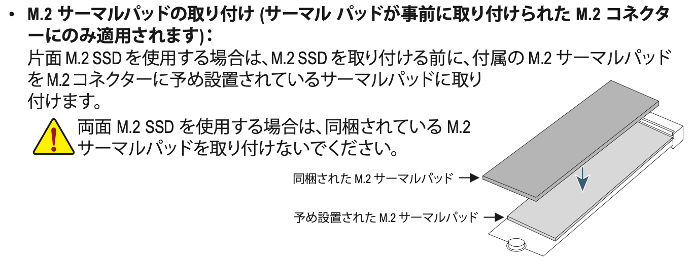

前回の[パーツ選定編](/2025/06/05/building-my-first-gaming-pc/)からの続き。書きかけのまま半年経ってしまいましたが、今回は組み立て編です。

## 組み立て

組み立てにはこちらの動画を参考にしました。

- 全体的な組み立て手順や必要な道具
  - [【2025年版】モンハンWQHD/100fps動作！25万円予算の白統一のオシャレゲーミングPC組み立て初心者ガイド【ASRock×Thermaltake提供】](https://www.youtube.com/watch?v=d69dHDImp1A)
- PCケース（MONTECH XR）について
  - [予算15万円！コスパ最高の白で光るゲーミングPC組んでみた！【 ASRock B760 Pro RS WiFi White 】](https://www.youtube.com/watch?v=UP-LVQczfco)
  - [【PCケース】激安なのに良くできたピラーレスケース MONTECH XRをレビュー 実際に組んで使用感などをチェックしました【自作PC】](https://www.youtube.com/watch?v=F4HX-qu8OGo)
- マザーボード（GIGABYTE B850 AORUS ELITE WIFI7 ICE）について
  - [【自作PC】GIGABYTEのB850 AORUS ELITE WIFI7 ICEでオールホワイトPCを組む！極まる白さと組みやすさ！簡易組立解説もあります！【自腹レビュー】](https://www.youtube.com/watch?v=4iG9oSpRZKI)

組み立ては以下の手順で行いました。

1. マザーボードにCPU・メモリ・1個目のSSD（システム用）を取り付ける
2. PCケースにマザーボード・電源ユニットを設置し、電源ケーブルとケースのケーブルをマザーボードに接続
3. CPUクーラーはラジエーターを固定してから水冷ヘッドを取り付け、ファンケーブルをマザーボードに接続
4. この段階で起動テストし、AMD EXPOのプロファイルをロードした上で[memtest86](https://www.memtest86.com/)でメモリテストを実行
5. Windowsをインストールして、初回セットアップのタイミングで一度シャットダウンする
6. 2個目のSSD（データ用）とグラフィックボード、サポートステイを取り付ける
7. グラフィックボード経由で映像出力ができることを確認
8. Windowsのセットアップに進み、各種ドライバーをインストール

### 難しかったところ

#### マザーボード上部への干渉

いくつか動画を見てつまづきポイントを予習したので、把握していた部分についてはハマらずにできました。

たとえば[MONTECH XR](https://www.dospara.co.jp/SBR79/IC514294.html)はラジエーターを天面に固定するとマザーボード上部に干渉してしまい、作業が難しくなることはすでに知っていました。
そのため先にCPU補助電源の接続はしたのですが、[GIGABYTE B850 AORUS ELITE WIFI7 ICE](https://www.gigabyte.com/jp/Motherboard/B850-AORUS-ELITE-WIFI7-ICE-rev-1x)はCPUクーラーのコネクターも上部にあり、ファンケーブルは接続していなかったため指先で頑張る羽目になりました。
ケース・クーラー・マザーボードの組み合わせで注意点が異なるのが難しいところです。

#### グリス塗り直し

今回のCPUクーラー（[MONTECH HyperFlow Silent 360 White](https://www.montechpc.com/hyperflow-silent-360)）にはすでにグリスが塗られていますが、取り付けたあと急に不安になり一度取り外して確認しました。
保護フィルムの剥がし忘れやグリスの塗り忘れはなかったので、単にグリスを塗り直す手間が増えただけになってしまいました……。

グリスの塗り方にも派閥があるようでしたが、今回はクーラーに付属していたグリスを塗るためのシートを利用。
グリスは金属同士の微小な凹凸を埋めるためにあるので薄く塗るだけでいいらしいんですが、だいぶ厚塗りしてしまった気がします。
まあ実際使ってて異常に温度が上昇することもないしいいとしましょう。

#### サーマルパッドがちぎれた

B850 AORUS ELITE WIFI7 ICEはM.2スロット3個をまるごと覆う大型のヒートシンクが搭載されているのはいいのですが、SSDを追加するときにヒートシンクを全部取り外すことになります（[この記事](https://www.gdm.or.jp/review/2025/0106/566958/3)を参照）。

サーマルパッドの貼り付け方もややこしく、上段のM.2スロットに片面実装のSSDを取り付ける場合、もともとあるスロット下部のサーマルパッドにさらにサーマルパッドを貼り付ける必要があります。
両側からサーマルパッドで密着することで熱を逃がしやすくしているそうです。
マニュアルには書いてあるのだが、初見ではわからんだろ！

こうして2個目のSSDを追加するときと、サーマルパッドを貼り付けるときにガチャガチャ開け閉めした結果、ヒートシンクに貼られているサーマルパッドがちぎれてしまいました。
幸い発熱が心配なPCIe 5.0スロットではなくPCIe 4.0の方だったので、若干の不安と引き換えにPCIe 5.0 SSDの安心を得られたと考えることにします。

## 感想

いや〜予習していてもなかなか難しいものだと思いました。
とはいえ一発で起動できて、初期不良もなさそうなので一安心です。半年経過した今も問題なく動いてくれています。

あとケースの中にフィギュアを入れるのが流行ってるのでやってみました。ピラーレスケースだとこういう遊びもできていいですね。
