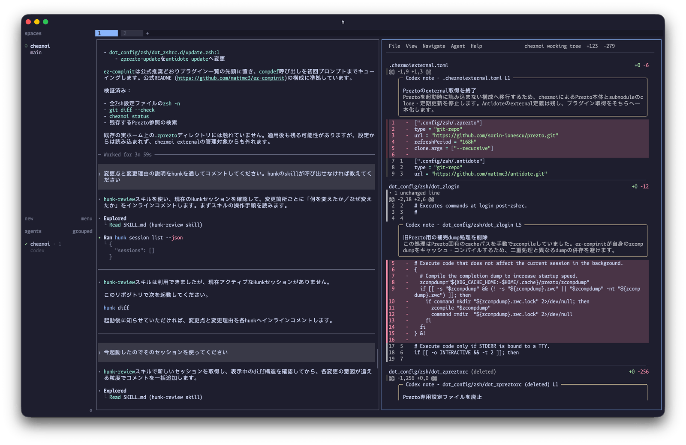
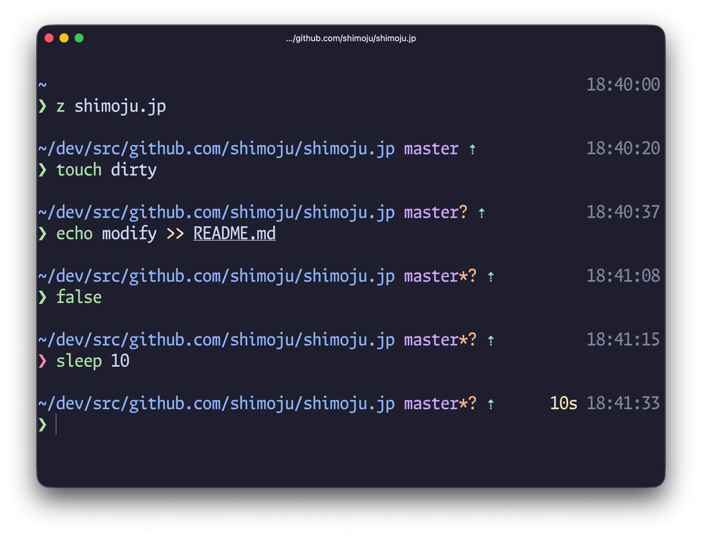
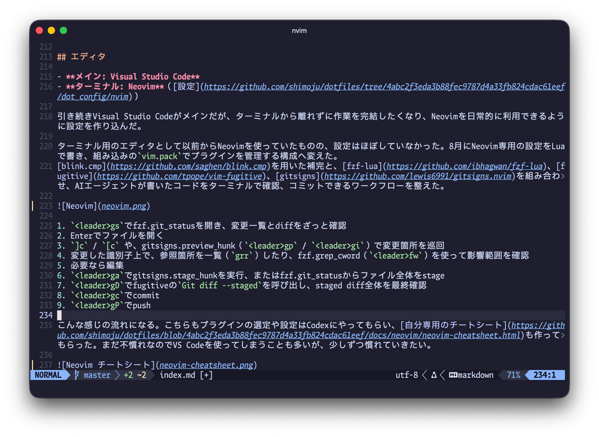
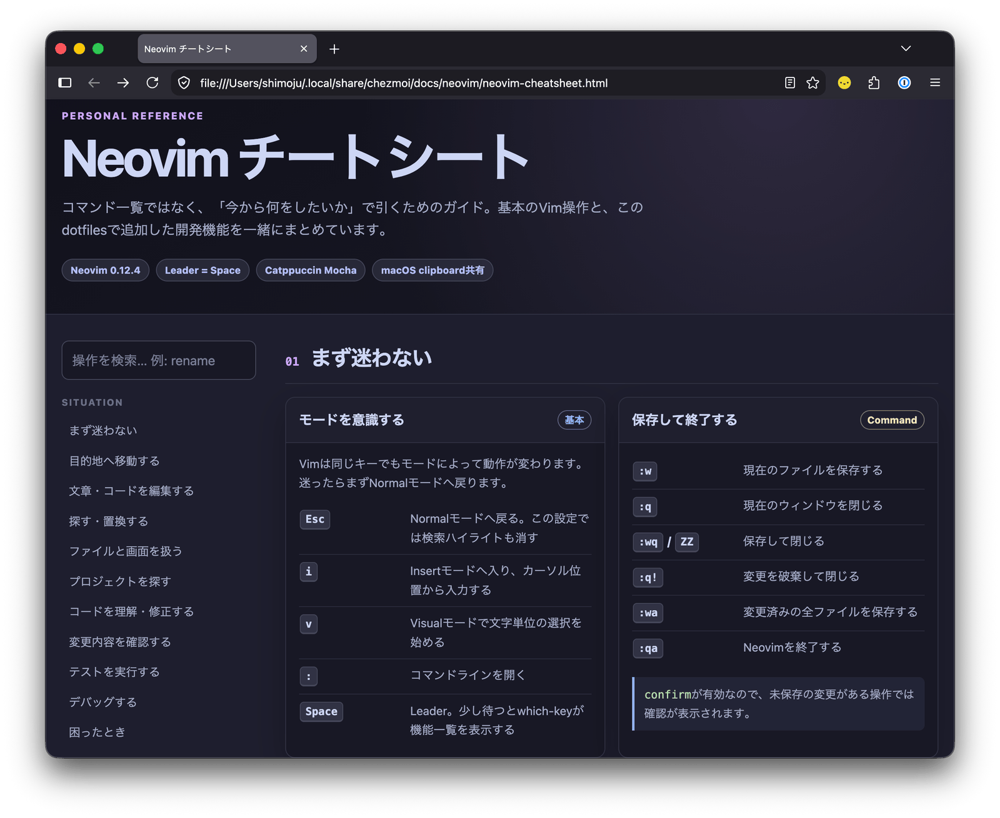

これまではVisual Studio Codeをメインに、ターミナルは補助として内蔵ターミナルで済ませることが多かった。
しかしAIを中心とした開発に移行し、自分でコードを書くことがほぼなくなった今、日々の作業がエディタよりもターミナル中心に移っている。

ターミナルに求めるものも変わってきて、AIエージェントを効率的に管理するための機能や、素早くエージェントを立ち上げられる起動の速さや応答性を重視するようになった。

ということでここ1、2か月ほど開発環境を見直していた。
ターミナルエミュレータだけでなく、マルチプレクサ、シェル環境、エディタ、言語ランタイム管理まで全体的に変わり、文字どおりほぼ一新した状態になった。

## ターミナルエミュレータ

- **iTerm2 → [cmux](https://cmux.com/ja) → [Ghostty](https://ghostty.org/)**（[設定](https://github.com/shimoju/dotfiles/blob/4abc2f3eda3b88fec9787d4a33fb824cdac61eef/dot_config/ghostty/config)）

5月にiTerm2からcmuxへ移り、7月からGhosttyを使い始めた。

cmuxが話題になって使ってみたものの、ズームがうまく動かないなど細部の作り込みがいまひとつだと感じていた。
その後herdrが好感触だったのでエージェント管理はherdrに任せ、ターミナルはGhosttyに切り替えた。
ターミナルとしての仕事に徹していて、デフォルトのキーバインドが必要十分かつMacアプリとして違和感のない配置になっているのが好み。

テキスト選択時のクリップボードコピー、タイトルバーをタブにする、ウィンドウ状態の保存など、iTerm2で利用していた設定を踏襲した。
テーマは[Catppuccin Mocha](https://catppuccin.com/)で、herdrやエディタのカラースキームもすべてこれで統一している。

```
copy-on-select = clipboard
font-family = Moralerspace Argon HW
font-size = 14
font-thicken = true
macos-option-as-alt = left
macos-titlebar-style = tabs
mouse-hide-while-typing = true
theme = Catppuccin Mocha
window-save-state = always
```

## ターミナルマルチプレクサ

- **未利用 → [herdr](https://herdr.dev/)**（[設定](https://github.com/shimoju/dotfiles/blob/4abc2f3eda3b88fec9787d4a33fb824cdac61eef/dot_config/herdr/config.toml)）

prefixキーが面倒でtmuxを挫折しており、マルチプレクサなあ〜と思っていたが、使ってみたら体験がとても良く虜になってしまった。
マウスでほぼすべての操作ができるためキーボード操作は少しずつ覚えていけばよく、とっつきやすいのもよかった。

herdrはcmuxと同様にWorkspace→Tab→Paneの3層構造だが、サイドバーに独立したAgentタブがあり、今どのエージェントが動いていて、どれが返事待ちなのかを一覧できるのも気に入っている。



Ghostty側のキーバインドでは一工夫した。

- Ghosttyではキーバインドに[performable:](https://ghostty.org/docs/config/keybind#performable:)というprefixをつけるとアクションが実行可能な場合にのみ入力が処理される
- Ghosttyのタブやペインがひとつのみのときは、`cmd+1-9`のタブ移動や`cmd+alt+矢印`のペイン移動は実行不可能なため、キーバインドが設定されていないかのように振る舞う
- herdrではprefixキーに加えて`cmd+1-9`や`cmd+alt+矢印`を受け取る

こうすることで、Ghosttyで複数のタブを開いているときはGhosttyのタブ移動として動作させつつ、タブがひとつのみのときはherdrのタブ移動として動く。

```
# Ghostty
keybind = performable:super+1=goto_tab:1
keybind = performable:super+2=goto_tab:2
...
keybind = performable:super+shift+[=previous_tab
keybind = performable:super+shift+]=next_tab
```

```toml
# herdr
previous_tab = ["prefix+p", "cmd+shift+["]
next_tab = ["prefix+n", "cmd+shift+]"]
switch_tab = ["prefix+1..9", "cmd+1..9"]
```

一方で`cmd+t`の新規タブ、`cmd+d`のペイン分割は常に実行可能なことからperformableは使えず、作成系の操作には通常のprefixキーを使っている。
もう慣れたし`cmd+t`や`cmd+d`も潰して全部herdr前提にしてもいいかもと思いつつ、デフォルトのキーバインドはできるだけ活かしたい派なので……。

ほかにはAIエージェントを素早く開けるように、`prefix+a`でペイン、`prefix+shift+a`でタブで開くカスタムコマンドを用意した。
[herdrのカスタムコマンド](https://herdr.dev/docs/configuration/#custom-command-keybindings)ではタブで開くオプションがないようで、[簡単なラッパースクリプト](https://github.com/shimoju/dotfiles/blob/4abc2f3eda3b88fec9787d4a33fb824cdac61eef/dot_local/bin/executable_herdr-open)を書いて実現した。

```toml
[[keys.command]]
key = "prefix+a"
type = "shell"
command = "herdr-open --pane --direction right -- codex"
description = "open coding agent in split"

[[keys.command]]
key = "prefix+shift+a"
type = "shell"
command = "herdr-open --tab -- codex"
description = "open coding agent in tab"
```

あと公式で紹介されている、`type = "popup"`を用いてポップアップウィンドウでターミナルを開くコマンドが地味に便利。

```toml
[[keys.command]]
key = "prefix+t"
type = "popup"
command = "exec \"${SHELL:-sh}\""
description = "open scratch terminal"
width = "80%"
height = "80%"
```

## AIエージェント

- **業務用: Cursor → Claude Code**
- **個人用: 未利用 → Codex, Claude Code**

これまで業務ではCursorを利用していたが、3月にClaude Codeに乗り換えた。

個人では別のAIを試したかったため、Claude Codeの安いプランに加えてCodex（ChatGPT Pro）を契約した。GPT-5.6は日本語も結構上手だし、`/goal`コマンドの自律的作業もいい感じ。
後述するZshフレームワークの移行や独自プロンプトの作成はCodexにやってもらった。

両者ともデスクトップアプリの開発が進んでおり、最終的にはデスクトップアプリにすべてが統一される未来もありそう。とはいえ現状はターミナルから離れずに作業できるほうが使いやすいし他ツールとも連携しやすいかなと思っている。

## シェル

- **シェル: Zsh**
- **プラグイン管理: [Prezto](https://github.com/sorin-ionescu/prezto) → [Antidote](https://antidote.sh/)**（[設定](https://github.com/shimoju/dotfiles/tree/4abc2f3eda3b88fec9787d4a33fb824cdac61eef/dot_config/zsh)）

シェルは引き続きZshを使っているが、フレームワークのPreztoをやめて素のZsh設定にした上で、プラグイン管理はAntidoteへ移行した。

AI時代になって設定を書くのが格段に楽になった。フレームワークの利点だった設定済みでオールインワンのメリットが薄れ、起動時間や依存関係の多さ、フレームワークが提供する範囲でしかカスタマイズできないといった制約が目立ってきた感があり、この機会に素の設定に書き直した。

プラグインは補完周りと、Preztoでも使っていた[zsh-syntax-highlighting](https://github.com/zsh-users/zsh-syntax-highlighting)、[zsh-history-substring-search](https://github.com/zsh-users/zsh-history-substring-search)、[zsh-autosuggestions](https://github.com/zsh-users/zsh-autosuggestions)の3点セットくらい。
[ez-compinit](https://github.com/mattmc3/ez-compinit)はcompinit処理を楽にしてくれるだけでなく、Preztoの補完スタイルを再現できるオプションもあり、移行にかなり役立った。

よく使う操作をシェルのショートカットに割り当てるやつ、やりたいと思いつつできていなかったのだが、AIに頼めば一瞬でやってくれてさすがである。`ctrl-s`でherdr起動、`ctrl-o`でfzfを用いたディレクトリ移動を設定した。

```zsh
# ctrl-s: herdrを起動
_herdr_widget() {
  zle .push-line
  BUFFER=' herdr'
  zle .accept-line
}
zle -N _herdr_widget
bindkey -M emacs '^S' _herdr_widget

# ctrl-o: ghq配下のリポジトリをfzfで検索して移動
# もともとfコマンドとして利用していたのでそれでも呼べるようにしてある
f() {
  local dir
  dir="$(ghq list --full-path | fzf --height "${FZF_TMUX_HEIGHT:-40%}" --min-height 20+ --bind=ctrl-z:ignore --reverse)" || return
  [[ -n "$dir" ]] || return
  builtin cd -- "$dir"
}

_ghq_fzf_cd_widget() {
  local previous_pwd=$PWD

  if ! f || [[ $PWD == $previous_pwd ]]; then
    zle .reset-prompt
    return
  fi

  zle .redisplay
  zle .kill-buffer
  zle .accept-line
}
zle -N _ghq_fzf_cd_widget
bindkey -M emacs '^O' _ghq_fzf_cd_widget
```

## シェルプロンプト

- **[Starship](https://starship.rs/) → [自作プロンプト](https://github.com/shimoju/dotfiles/blob/4abc2f3eda3b88fec9787d4a33fb824cdac61eef/dot_config/zsh/prompt/prompt_shsh_setup)**

Starshipはさまざまな情報を表示できて役立つものの、gitの状態を同期的に取得して描画しており、大規模リポジトリだと顕著に遅くなるのが気になっていた。
調べたところ、git statusを非同期で取得して完了後にプロンプトを書き換えることで、体感速度を向上させる工夫をしている実装があることがわかった。

候補としては[Pure](https://github.com/sindresorhus/pure)、[Powerlevel10k Lean Style](https://github.com/romkatv/powerlevel10k)、[Typewritten](https://github.com/reobin/typewritten)が挙がり、まずはPureを試した。
使い心地は素晴らしかったが、Starshipにあった時刻表示がなんだかんだ便利で、できれば右寄せで出したい……となり、AIがあれば自作できるのでは？と思い立ち実装してみた。



1行目左側のカレントディレクトリとgit status表示はPureの形式を引き継ぎ、右側にコマンド実行時間・時刻を表示するようにした。
自作すれば情報はどこにでも表示し放題だが、言語バージョンは表示せず、Nerd FontsによるリッチなアイコンもなくしてPureライクなミニマルスタイルに振り切ったのがこだわりポイント。
代わりにCatppuccin Mochaのカラーパレットを採用してカラフルな見た目に。色が自分好みになるだけで満足度が上がる。

既存実装も調査して、たとえばPureではgitのブランチ名取得と詳細ステータス取得を別々の非同期ジョブに分けており、git statusが重いリポジトリでもブランチ名は先に表示する、という工夫をしていて感心した。この手法は自作プロンプトにも取り入れている。



動画では`touch`コマンドで未追跡ファイルを作成後、プロンプトはすぐに表示され、git statusの取得完了後に`?`マークが追加で描画されたことがわかる。重いリポジトリでも非同期処理によって応答性能を保てるようになった。

今回はVibe Codingで実装しており、コードは明らかに変なことやってないか、重複コードがないかを見たくらい。以下のような方法で検証した。

- 事前に壁打ちして要件をドキュメントにまとめ、実装後その要件を満たしているかを自己検証させる
- 擬似端末を用いた表示テストを記述
- 大規模リポジトリを用いて既存実装とともにベンチマークを取り、パフォーマンスを比較検証
- 別のセッションでレビューし、修正案をさらに別のセッションで評価した上で取り込む
  - Claude Codeの`/code-review`や`/simplify`が役立った
- 実際に自作プロンプトを開き、挙動が期待通りか確認
  - 最後は人間がやるしかない

ベンチマークを取ったのはナイスで、AIが自律的にボトルネックを特定してパフォーマンス改善を進めてくれたし、修正案の評価も定量的にできるようになった。
Prezto廃止、mise移行による削減もあり、シェル全体の起動時間は約90〜100msまで短縮できた。爆速になって嬉しい。

## エディタ

- **メイン: Visual Studio Code**
- **ターミナル用: Neovim**（[設定](https://github.com/shimoju/dotfiles/tree/4abc2f3eda3b88fec9787d4a33fb824cdac61eef/dot_config/nvim)）

引き続きVisual Studio Codeがメインだが、ターミナルから離れずに作業を完結したくなり、Neovimを日常的に利用できるように設定を作り込んだ。

ターミナル用のエディタとして以前からNeovimを使っていたものの、設定はほぼしていなかった。8月にNeovim専用の設定をLuaで書き、組み込みの`vim.pack`でプラグインを管理する構成へ変えた。
[blink.cmp](https://github.com/saghen/blink.cmp)を用いた補完と、[fzf-lua](https://github.com/ibhagwan/fzf-lua)、[fugitive](https://github.com/tpope/vim-fugitive)、[gitsigns](https://github.com/lewis6991/gitsigns.nvim)を組み合わせ、AIが書いたコードをターミナルで確認、コミットできるワークフローを整えた。



1. `<leader>gs`でfzf.git_statusを開き、変更一覧とdiffをざっと確認
2. Enterでファイルを開く
3. `]c` / `[c` や、gitsigns.preview_hunk（`<leader>gp`）、gitsigns.preview_hunk_inline（`<leader>gi`）で変更箇所を巡回
4. 変更した識別子上で、参照箇所を一覧（`grr`）したり、fzf.grep_cword（`<leader>fw`）を使って影響範囲を確認
5. 必要なら編集
6. `<leader>ga`でgitsigns.stage_hunkを実行、またはfzf.git_statusからファイル全体をstage
7. `<leader>gD`でfugitiveの`Git diff --staged`を呼び出し、staged diff全体を最終確認
8. `<leader>gc`でcommit
9. `<leader>gP`でpush

こんな感じの流れになる。こちらもプラグインの選定や設定はCodexにやってもらい、[自分専用のチートシート](https://github.com/shimoju/dotfiles/blob/4abc2f3eda3b88fec9787d4a33fb824cdac61eef/docs/neovim/neovim-cheatsheet.html)も作ってもらった。まだ不慣れなのでVS Codeを使ってしまうことも多いが、少しずつ慣れていきたい。



## フォント

- **[UDEV Gothic](https://github.com/yuru7/udev-gothic) → [Moralerspace Argon](https://github.com/yuru7/moralerspace)**

Ghostty移行と同時に、欧文に[Monaspace](https://monaspace.githubnext.com/)、和文に[IBM Plex Sans JP](https://github.com/IBM/plex)などを採用した[Moralerspace](https://github.com/yuru7/moralerspace)に変えてみた。

UDEV Gothicをはじめとする[yuru7](https://github.com/yuru7)さんの合成フォントには半角3:全角5のバリエーションがあり、欧文がゆったりとした幅で表示できる。
エディタではこの半角3:全角5を愛用していたが、AIエージェントの影響でターミナルで長文を読む機会が増えたこともあり、半角1:全角2の幅で表示したときの読みやすさや統一感をより重視するようになった。

MoralerspaceはUDEV Gothicよりも半角1:全角2の幅で表示したときに欧文の圧迫感が少なく、洒落っ気がある印象。等幅フォントでありながら、前後の文字に応じて字形や余白を調整する[Texture healing](https://monaspace.githubnext.com/#texture-healing)もギミックとしておもしろい。

Ghosttyでは半角1:全角2のMoralerspace Argon HWを、Visual Studio Codeでは半角3:全角5のMoralerspace Argonを利用している。

## 言語ランタイム管理

- **[anyenv](https://github.com/anyenv/anyenv) → [mise](https://mise.jdx.dev/)**（[設定](https://github.com/shimoju/dotfiles/blob/4abc2f3eda3b88fec9787d4a33fb824cdac61eef/dot_config/mise/config.toml)）

長らく利用してきたanyenv（rbenv、nodenv、pyenv）をやめて、言語ランタイムはすべてmiseで管理するようにした。
pnpmや[skills](https://github.com/vercel-labs/skills)などグローバルにインストールしたいnpmパッケージもmise管理にし、`minimum_release_age`でクールダウンを設定してある。

miseではRubyのコンパイル済みバイナリも提供されているが、OpenSSLのlegacy providerが無効化されてコンパイルされており、業務アプリで必要だったため`compile = true`にした（残念）。
`postinstall`に`gem install`を記述すれば[rbenv-default-gems](https://github.com/rbenv/rbenv-default-gems)の代替もできる。

Rustもrustupからmiseに移行したが、[miseのRust管理](https://mise.jdx.dev/lang/rust.html)では内部的にrustupを用いているため、個別で管理するのをやめた、が正確なところ。

今のところ言語ランタイムとグローバルnpmパッケージの管理のみに絞っており、システムパッケージやGUIアプリは引き続きHomebrew（[Brewfile](https://github.com/shimoju/dotfiles/blob/4abc2f3eda3b88fec9787d4a33fb824cdac61eef/dot_config/homebrew/Brewfile)）で管理している。
バージョンを切り替える用途がなければmiseのうまみがあまりない気がするのだが、統一したほうが楽なのかな〜うーん。

## ブラウザ

- **業務用: Google Chrome**
- **個人用: Firefox**

ブラウザの多様性はあったほうがいいよなと思い、2年ほど前からFirefoxに戻った。動かないサイトにはほぼ出会ったことはなく、普通に使えている。

明確にパフォーマンス差を感じるのはGoogle Meetくらいで、業務ではそのMeetや組織のGoogleアカウント管理の都合があるためChromeを利用。

## Markdownビューア

- **Visual Studio Code → [Glow](https://github.com/charmbracelet/glow), [mo](https://github.com/k1LoW/mo)**

MarkdownはもっぱらVS Codeで開いていたが、SKILL.mdをさっと確認したいといった用途も増えてきたため、専用のMarkdownビューアも導入した。
ターミナル内でMarkdownをさっと読むときはGlow、Mermaidなど図表を含むドキュメントを読むときはブラウザで動くmoを使っている。

## diffビューア・レビューツール

- **通常のgit diff → [delta](https://github.com/dandavison/delta), [Hunk](https://hunk.dev/), [GitUI](https://github.com/gitui-org/gitui)**

gitのpagerとしてdeltaを導入し、シンタックスハイライトや変更部分の強調がされるようにした。
AIが書いたコードは読みづらいことも多いので、diffの視認性が上がるのは地味だけど効果が高いと思う。

deltaのデフォルト設定では行番号や行頭記号は省略される。表示すると判別しやすくはなるが、diffからコードをそのままコピペできるのを意図しているらしく、これが意外と便利なのでデフォルトのまま使っている。

HunkはAIと人間が相互にコメントできるレビュー機能を持ったdiffビューアで、話題になっていたので導入。ただ権限の問題でAIエージェントから既存のHunkセッションが見えないことがあったり、動作がやや重いこともあってあまり使いこなせていない。
ターミナルにこだわらず、ブラウザで動く[difit](https://github.com/yoshiko-pg/difit)や[Crit](https://github.com/tomasz-tomczyk/crit)の方がいいかも。

gitのコマンド操作に慣れているのでTUIの必要性はそこまで感じていないが、GitUIもインストールしてみた。git logを追うときはこっちのほうが見やすそう。

## ファイルマネージャ

- **未利用 → [Yazi](https://yazi-rs.github.io/)**（[設定](https://github.com/shimoju/dotfiles/blob/4abc2f3eda3b88fec9787d4a33fb824cdac61eef/dot_config/yazi/yazi.toml)）

使用頻度は高くないが、ターミナルファイルマネージャとして新しく導入した。
画像表示プロトコルに対応したターミナルエミュレータであれば画像やPDFも表示できてすごい。

Ghosttyは[Kitty unicode placeholders](https://sw.kovidgoyal.net/kitty/graphics-protocol/#unicode-placeholders)に対応しており綺麗に表示できるが、herdrでは[experimental扱いのため](https://herdr.dev/docs/configuration/#kitty-graphics)、明示的に`kitty_graphics = true`を設定する必要がある。

## 標準コマンドの代替いろいろ

- **[eza](https://eza.rocks/), [zoxide](https://github.com/ajeetdsouza/zoxide), [ripgrep](https://github.com/burntsushi/ripgrep), [fd](https://github.com/sharkdp/fd), [bat](https://github.com/sharkdp/bat)**

ripgrepは以前から入れていたが、調べると標準コマンドの代替ツールが色々出ていることに気づき、ひととおりインストールしてみた。
一番使っているのはシンタックスハイライト・行番号付きでcatできるbatと、アイコンやgitステータス付きでlsできるeza。

## dotfiles管理

- **[chezmoi](https://www.chezmoi.io/)**

昨年[itamaeからchezmoiへ移行](/2025/12/07/chezmoi-dotfiles-manager/)し、引き続きdotfilesはchezmoiで管理している。
miseにも[dotfiles管理機能](https://mise.jdx.dev/dotfiles.html)があるようだが、思想がだいぶ異なりそうなのでまだ試していない。

## まとめ

2026年9月時点の環境をまとめてみた。

herdrやHunkなどAIエージェントのためのツールも有用だが、一番満足したのはGhostty移行やZshのカスタマイズ、プロンプトの自作を通して、基礎となるターミナル操作が快適になったこと。やってよかった。

短期間に一気に更新したので、しばらくしたらまた所感を書きたい。
Neovimマスターになって爆速で編集作業ができている可能性もあるし、挫折しているかもしれない。
2027年にはAIデスクトップアプリがメインになってる説は割とありそう。

dotfilesの全体は[shimoju/dotfiles](https://github.com/shimoju/dotfiles)にある。
